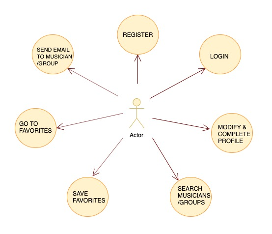
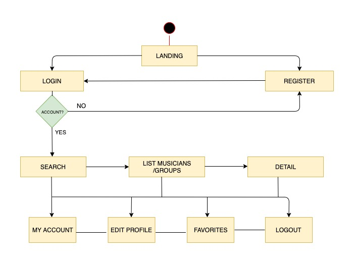
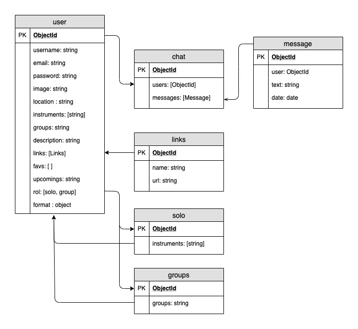
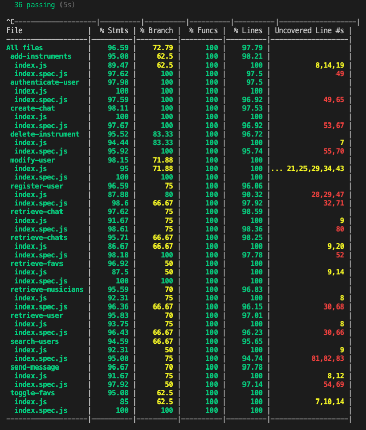
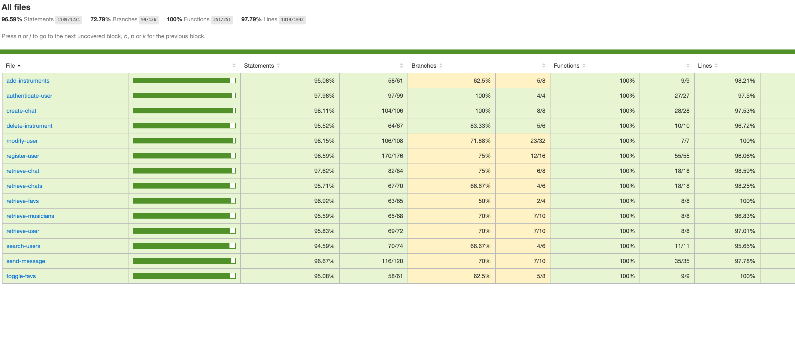

# UpBeat

## Introduction

UpBeat is a community for musicians that helps to establish contacts between them in aim to build music groups or collaborations. UpBeat also provides a personal area where musicians can make themselves known in the community. 

## Functional Description

Users can:

* Create a personal profile.

* Modify their profile and add information and a profile picture.

* Search other musicians by username or the instruments they play.

* Search groups of music by name or type of group.

* See the detailed information in the profile of musicians/groups and access to their social media or websites.

* Add and remove users or groups to favorites.

* Contact with other users or groups by email. 

### Use Cases

### Flowcharts

## Technical Description

### Data model

### API coverage

## Technologies

Javascript, ReactJS, Node.js, Express, MongoDB & Mongoose.

## To do

* Implement chat between users.

* Testing app.

* Implement modification of instruments on view Edit profile.

* Finish logic documentation.

* Add feedback.

* Improve search view with clearer criteria.